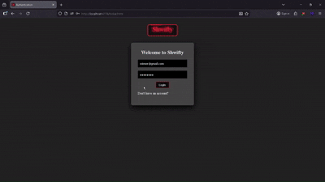

# Shwifty

## Key Technical Achievements
### Real-Time Event Architecture
- **WebSockets**: Used socket.io to power Shwifty making it possible to have a fast and reliable Bidirectional stream of data. While disabling HTTP polling and forcing websocket transport the app maintains integrity and reduces unnecessary server requests.
### Unique User Tracking
- **Online-Users**: Created unique user tracking logic using Map and Set logic to distinguish users based on their Unique-id and displaying online user count on the Chat-Page.
### Full-stack Architecture
- **Online Presence**: Used git to track all changes in the Codebase While vercel provided a complete pipeline. which allowed a local push command to update the live web-application hosted on vercel. And the server hosted on huggingface also connected to the vercel-page, allowing the app to be running 24/7 on the Internet.
## Features
### Direct Messages
- Added direct messages using dynamic private rooms. By generating a unique id to ensure distinct conversation channels.
### Notifications
- Added smart notifications using browser's api. Ensuring that they are private and only trigger when the user is Inactive in the chat.
### Secure Authentication
- Supabase authentication integrated in the Codebase allowed Shwifty to possess secure and reliable authentication.
### Persistent Global History
- Saving every message with the user's name, userId, time and content to a Database on the cloud and in this case Supabase's PostgreSQL made it possible to Fetch old messages from the dataBase upon login, so user's can have long conversations without worrying about losing conversation upon logging out or closing the browser.
### Live Feedback Loop
- Added a typing indicator using webSockets allowing user's to see if another user is currently typing and their name while the online count on top of the screen allows user's to see if any other person beside them is online in the Application.
### Build Pipeline
- Built pipelines on Vercel and Hugging Face to handle TypeScript build steps.

## Security and Quality(v3.8.0 - v4.0.0)
- **Strict Typing** Used TypeScript interfaces to ensure data integrity.
- **XSS Protection** Implemented sanitization logic to protect against HTML/Scripts injections.
- **Automated Testing**: Integrated **Jasmine** for unit testing the sanitization logic to ensure reliability of security.

## Tech Stack

- **Frontend**: HTML5, CSS3, TypeScript.
- **Backend**: Node.js, Express, Socket.io(only WebSocket Transport).
- **DataBase & Auth**: Supabase's PostgreSQL & Authentication.
### Deployment:
- **Client**: Vercel(CI/CD)
- **Server**: Hugging Face(Docker/Node runtime)
- **Version Control**: Git & Github

## Project Evolution
- **V1** Started with the UI and Supabase fetching messages everytime a user sends a message and saving it to storage.
- **V2** Created a backend using node.js and socket.io to enable realtime conversation rather then sending a http request everytime a user sent message the web-sockets holds a persistent connection for fast Bidirectional stream of data while still saving the data to Database.
- **v3** Added Direct messages to shwifty.Using dynamic rooms based on users UUIDS to create private chats.
- Added smart notifications for global lobby and private chats using browser's Api.
- Much more refined UI inlcuding animation for a better Ux.
- Dynamic loading screens based on user's action.
- Async race patterns hadles data fetching by utilizing Promise.race to handle server timeout.
- **v3.8.0**
- The entire codebase was migrated to TypeScript to ensure maximum reliability and catch erros at compile time rather then runtime.

## Challenges 
- **feat: Online Count**, Initially I tried to implement a online count based on the number of users connected to webSocket but because of my limited experience with webSockets I didn't realise that because of the transport upgrade from http would cause double connection which would consequently show double the amount of users in the online count so upon research I found that rather then basing the online count on number of connections I should base it on number of Unique-id's which solved the problem of doubling count.
- **TypeScript Migration** I was not familiar with TypeScript at all so had to learn the basic even setting up the config file was a challenge at first. The overall migration to TypeScript was not as challenging as I initially thought however the amount of errors I faced was really tiring. I had to understand how to run builds locally and run the server locally to ensure that the logic is correct and after that deployed to Vercel and Hugging Face and had to debug building on both platforms and after a lot of back and forth  I was successfull. The few things I took away from it was that It was better for me to only use WebSocket transport rather then both polling and websockets which was causing bugs on some browsers.